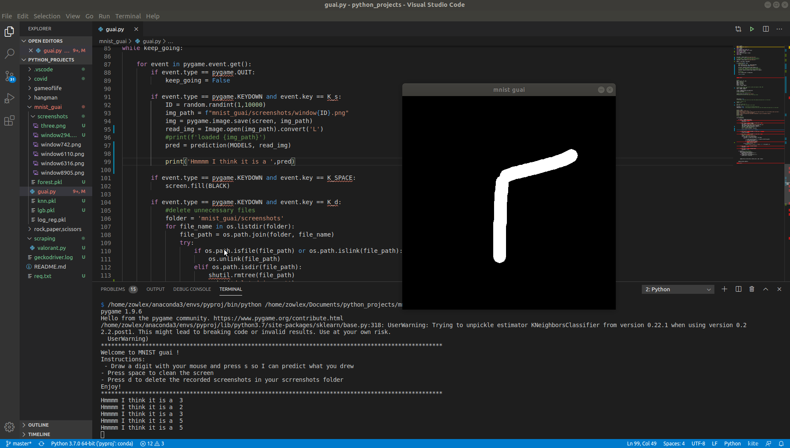

This project is the extension of [this](https://github.com/Zowlex/100DaysofMLCode/blob/master/End-to-end%20ML%20project/Classification.ipynb) project from Hands-on ML book which consists of:
      - Training an MNIST digit classifier with the accuracy of 97% (only using a knn classifier,not a neural networks)
      - Exporting the model and using it for inference in a gui pygame app
      - Draw the digit with your mouse the app predicts which digit you drew
